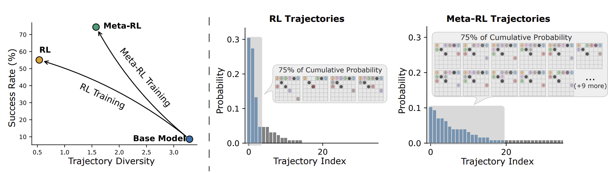
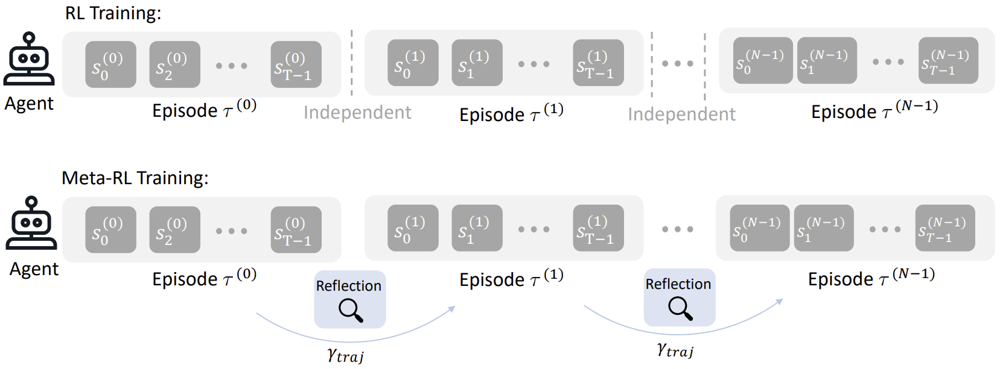

## Meta-RL Induces Exploration in Language Agents

[Yulun Jiang*](https://yljblues.github.io), [Liangze Jiang*](https://liangzejiang.github.io/), [Damien Teney](https://www.damienteney.info/), [Michael Moor**](https://michaelmoor.me/), [Maria Brbić**](https://brbiclab.epfl.ch/team/)

[`Project page`](https://brbiclab.epfl.ch/projects/LaMer/) | [`Paper`](https://arxiv.org/abs/2512.16848) | [`BibTeX`](#citing) 

--------------

This repo contains the source code of 🌊LaMer, a Meta-RL framework of training LLM agents to actively explore and adapt to the environment at test time (ICLR '26).

</br>
<div align="left" style="padding: 0 0pt">

</div>
</br>

## Training
To train the LLM Agent with LaMer:
```
bash examples/minesweeper/lamer_minesweeper_qwen3_4b.sh
```
To train the LLM Agent with RL baselines:
```
bash examples/minesweeper/gigpo_minesweeper_qwen3_4b.sh
```
See the `examples` folder for more examples. 

</br>
<div align="left" style="padding: 0 0pt">

</div>
</br>

## Environment
Please follow this [note](https://github.com/mlbio-epfl/LaMer/tree/main/assets/env.md) to install and test the agent environments.


## Acknowledgements
This work is built upon [verl](https://github.com/volcengine/verl), [verl-agent](https://github.com/langfengQ/verl-agent), [reflexion](https://github.com/noahshinn/reflexion), [RAGEN](https://github.com/mll-lab-nu/RAGEN). We thank the authors and contributors of these projects for sharing their valuable work.


## Citing
If you find our code useful, please consider citing:

```
@inproceedings{jiang2026metarl,
    title={Meta-RL Induces Exploration in Language Agents},
    author={Yulun Jiang and Liangze Jiang and Damien Teney and Michael Moor and Maria Brbic},
    booktitle={International Conference on Learning Representations}
    year={2026}
}
```

